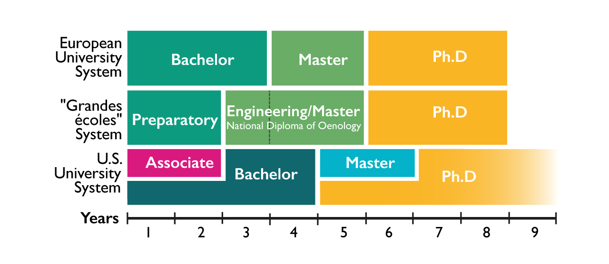

# FrenchEducation
https://docs.google.com/presentation/d/1qUXvCXFNSqTpE3NqcwFbjx7wIy6GDwdDLWZ9zIetfSw/edit?pli=1#slide=id.g8ca29aa004_0_326

# Path to "CDI"
CDI is an acronym for Contract Durée Indeterminée. In France, people love acronyms. This one is probably one of the most important ones. It stands for a lifetime contract. Being very attractive, so hard to attain. My intention, was to investigate French higher education system and its relation to the job placement rates within principal domains. And to see in what impact domain of study, university ranking, degree attended affects job placement rates.

My interest in that topic is driven by some French people's idea, that you shouldn't necessarily have a higher education in order to get a nice. 

In this exploratory data analysis, I address following questions:
    - Does studying for longer increases my chances to get a job?
    - Does the university I go can impact my chances to get a job?
    - Does domain/discipline I choose affect my chances to end up being employed?
 
# The Data 
There are two branches of higher education in France. First is European University System, which include Bachelors, Masters, and Doctoral studies. Second is "Grandes écoles" system, traditional French higher education. It consists of two years of preparatory classes, followed by Engineering/Management/Law/etc. schools and Doctoral studies. First system is mostly public, whereas second is privat.

      

I analysed the aggregated datasets from governmental French website (https://www.data.gouv.fr/), that summarise information gathered from students, that attain their degrees in public French universities within European University System. Data was collected after 12-18 months and 30-36 months after getting diploma: their job placement rates and salaries were collected. Datasets contain ~2000000 answers from about 60 universities accross France for 2010-2016 years range.

    - https://www.data.gouv.fr/fr/datasets/insertion-professionnelle-des-diplomes-de-master-en-universites-et-etablissements-assimiles/
    - https://www.data.gouv.fr/fr/datasets/insertion-professionnelle-des-diplome-e-s-de-licence-professionnelle-en-universites-et-etablissements-assimiles/
    - https://www.data.gouv.fr/fr/datasets/insertion-professionnelle-des-diplomes-de-doctorat-par-ensemble-universitaire/
    - https://data.enseignementsup-recherche.gouv.fr/explore/dataset/fr-esr-principaux-etablissements-enseignement-superieur/information/?disjunctive.type_d_etablissement

# Salary
Universities homogeneously distributed across the country.

    

Dots on the map above represent universities locations, whereas size of those dots correspond to number of students within each of the following domains in descending order:

    1. Law, Economics and Management
    2. Science, Technology and Health 
    3. Social and Humanity Sciences
    4. Teaching
    5. Letters, Languages, Arts
    

It's not fair to compare Bachelors' against Masters' salaries straight after graduation, because Bachelor students would gain 2 years of experience by the time their mates would finish their Master program. However, it's worth noticing, that avarage salaries grow with each higher education step within each domain. Transparent and solid boxplots represent salaries one year and 3 years after graduation, respectively.

      

# Job placement rates
Let's have a look how job placement rates vary with each degree attained. Although average job placements are quite high, it seems that within each domain, mean values are rather decreasing.

      

Let's check that hypothesis.

# Hypothesis testing
### 1st hypothesis
My null hypothesis would be that **higher level of education achieved does not affect chances to get a job**. 

Let's take an example of Science, Technology and Health domain and compare Bachelors and Masters graduates.

| Job type      |   p-value            | Result         |
|---------------|:--------------------:|----------------|
| Any job       | 0.35 > 0.05          | Fail to reject |
| Full-time job |  | Reject         |

Those results suggests, that whether there is no statistically signigicant difference in job placements for those students who found any kind of job, there is a difference for those who found full-time jobs. And it's indeed more chances to find full time job for a Bachelor diploma holder in Science, Technology and Health domain.

### 2nd hypothesis
My second question: is studying in high-rank universities affect chances to get a job? So my null hypothesis would be that **studying in high-rank universitites doesn't affect chances to get a job**.

| Job type      |   p-value      | Result         |
|---------------|:--------------:|----------------|
| Any job       | p << 0.05      | Reject         |
| Full-time job | p << 0.05.     | Reject         |

The answer is yes, studying in one of top 20 universities increase graduates' chances to become employed.

# Conclusion
It seems that studying longer and attaining higher degrees in France don't have a straightforward impact on the job placement rates. And threre are reasons for that, for a person with little experience, employer will have to pay more, if that person holds higher degree. So if he has a choice between Bachelor and Master, he will rather take Bachelor. That could be one possible reason for the data I have explored. But there could be other.

High-rank universities (top 20) have statistically higher job placement rates compare to all other universities. 